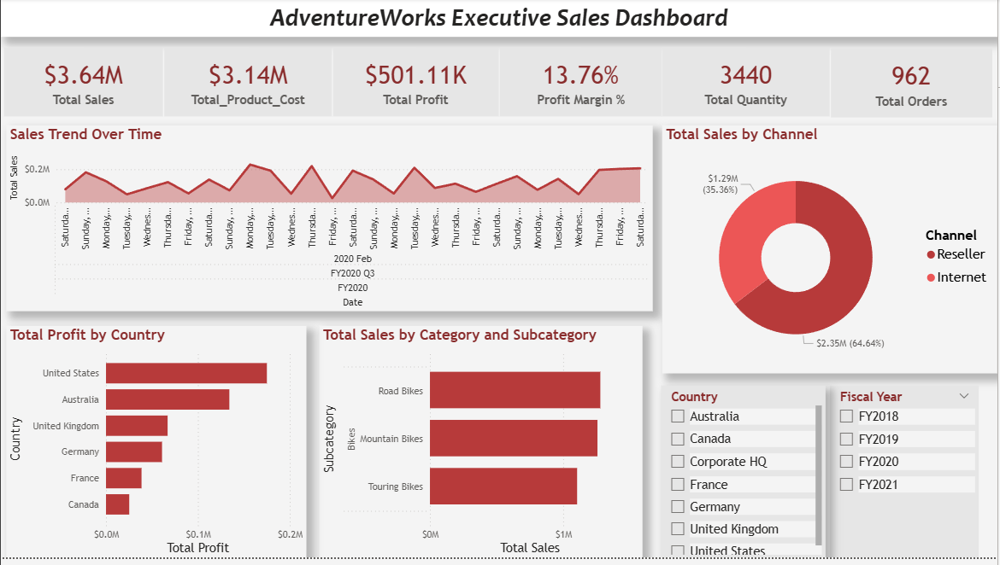
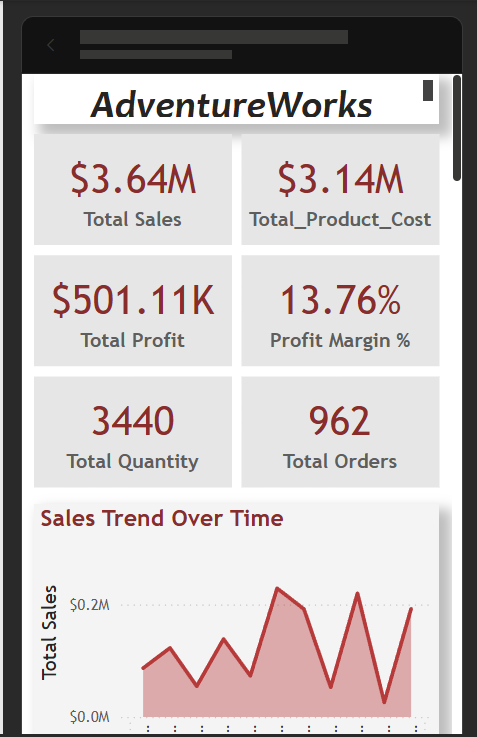
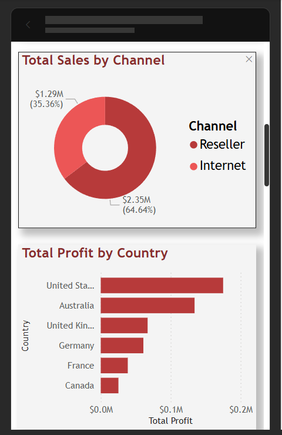
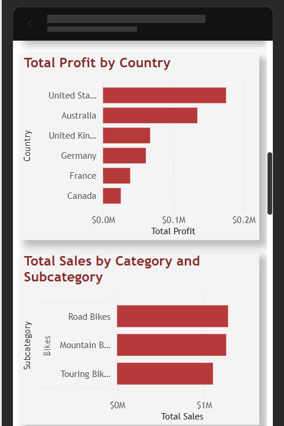
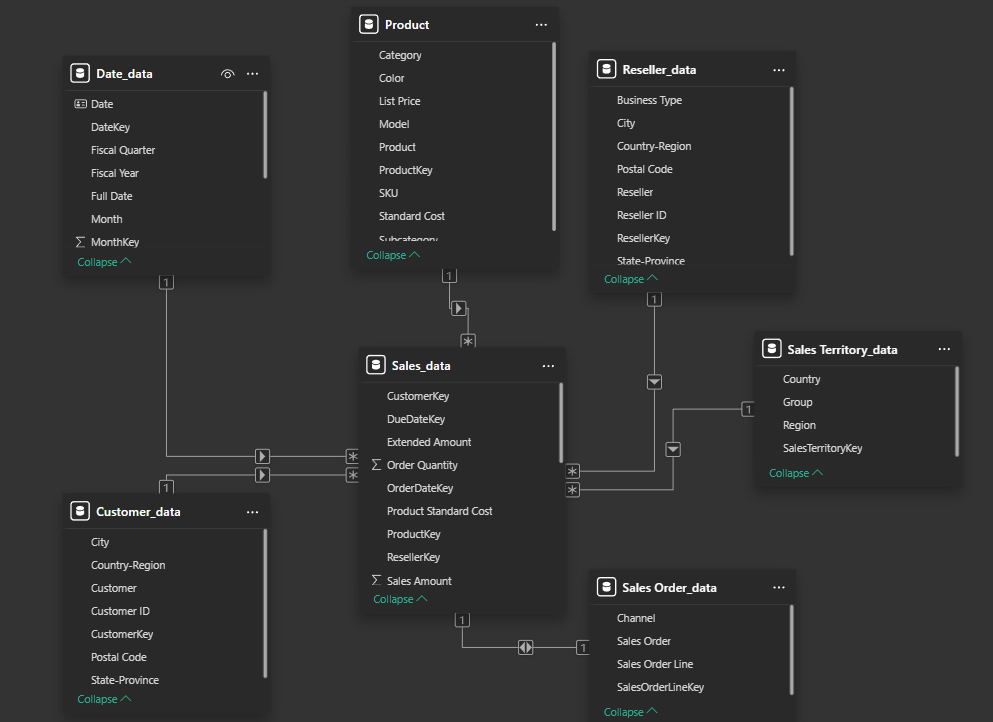

# AdventureWorks Executive Dashboard

## Overview

This project is an interactive Executive Sales Dashboard developed using Microsoft Power BI. The dashboard is designed to provide leadership and management with a clear overview of key business performance metrics and support data-driven decision-making.

The dashboard uses the Microsoft AdventureWorks Sales dataset and presents important sales, profitability, product, regional, and channel insights through interactive visualizations.

The project also includes drill-down analysis, a mobile-friendly layout, cloud-based data connectivity, and automated data refresh using Power BI Service.

---

## Project Objectives

The main objectives of this project were to:

- Identify critical KPIs required for executive-level decision-making.
- Design a clear and intuitive high-level dashboard.
- Create interactive visualizations for business performance analysis.
- Implement drill-down capabilities for detailed analysis.
- Configure automated data refresh using Power BI Service.
- Create a mobile-friendly dashboard layout.
- Provide an automated reporting schedule.

---

## Tools and Technologies

- Microsoft Power BI Desktop
- Power BI Service
- Power Query
- DAX
- Microsoft Excel
- Microsoft OneDrive

---

## Dataset

The project uses the Microsoft AdventureWorks Sales dataset.

The dataset contains multiple related tables including:

- Sales
- Products
- Customers
- Resellers
- Sales Territories
- Sales Orders
- Date information

The dataset was organized using a star-schema-based data model, where the main Sales table is connected to supporting dimension tables.

---

## Data Model

The following relationships were created between the tables:

- Product → Sales
- Customer → Sales
- Reseller → Sales
- Sales Territory → Sales
- Date → Sales
- Sales Order → Sales

The model allows the dashboard to analyse sales performance across different dimensions such as products, customers, regions, sales channels, and time periods.

---

## Key Performance Indicators

The dashboard includes the following executive KPIs:

- Total Sales
- Total Profit
- Profit Margin
- Total Orders
- Total Quantity Sold
- Average Order Value
- Previous Year Sales
- Sales Growth Percentage

These measures were created using DAX.

### Total Sales

```DAX
Total Sales =
SUM(Sales_data[Sales Amount])
```

### Total Product Cost

```DAX
Total Product Cost =
SUM(Sales_data[Total Product Cost])
```

### Total Profit

```DAX
Total Profit =
[Total Sales] - [Total Product Cost]
```

### Profit Margin

```DAX
Profit Margin % =
DIVIDE(
    [Total Profit],
    [Total Sales],
    0
)
```

### Total Orders

```DAX
Total Orders =
DISTINCTCOUNT('Sales Order_data'[Sales Order])
```

### Total Quantity

```DAX
Total Quantity =
SUM(Sales_data[Order Quantity])
```

### Average Order Value

```DAX
Average Order Value =
DIVIDE(
    [Total Sales],
    [Total Orders],
    0
)
```

### Previous Year Sales

```DAX
Previous Year Sales =
CALCULATE(
    [Total Sales],
    SAMEPERIODLASTYEAR(Date_data[Date])
)
```

### Sales Growth Percentage

```DAX
Sales Growth % =
DIVIDE(
    [Total Sales] - [Previous Year Sales],
    [Previous Year Sales],
    BLANK()
)
```

---

## Dashboard Features

### Executive KPI Cards

The dashboard provides a quick overview of important business metrics including:

- Total Sales
- Total Profit
- Profit Margin
- Total Orders
- Average Order Value

These KPIs allow management to quickly understand overall business performance.

---

### Sales Trend Analysis

A line chart is used to analyse sales performance over time.

The report supports time-based drill-down analysis using:

```text
Year
  ↓
Quarter
  ↓
Month
```

This helps users identify sales trends, seasonal changes, and performance over different time periods.

---

### Product Performance Analysis

Sales performance can be analysed using the following hierarchy:

```text
Category
  ↓
Subcategory
  ↓
Product
```

This allows users to move from a high-level product category view to more detailed product-level information.

---

### Geographic Analysis

The dashboard includes profit analysis by country and sales territory.

This helps management identify high-performing and low-performing geographic markets.

---

### Sales Channel Analysis

Sales performance is compared across different sales channels such as:

- Internet
- Reseller

This helps users understand which sales channels contribute the most to overall business performance.

---

### Interactive Filters

The report includes interactive slicers that allow users to filter dashboard results based on:

- Fiscal Year
- Country

All dashboard visuals respond dynamically to the selected filters.

---

## Drill-Down Capability

Drill-down functionality was implemented to provide more detailed analysis while keeping the main executive dashboard simple and easy to understand.

### Product Drill-Down

```text
Category
  ↓
Subcategory
  ↓
Product
```

### Time Drill-Down

```text
Year
  ↓
Quarter
  ↓
Month
```

This allows users to explore detailed information directly within the dashboard.

---

## Mobile-Friendly Dashboard

A separate mobile layout was created using Power BI's Mobile Layout feature.

The mobile dashboard was optimized by:

- Placing important KPIs at the top.
- Using a vertical dashboard layout.
- Optimizing slicers for smaller screens.
- Resizing charts for mobile readability.
- Ensuring that visual elements do not overlap.
- Keeping the most important business information easy to access.

---

## Automated Data Refresh

The dashboard's Excel data source is stored in Microsoft OneDrive.

The Power BI semantic model is connected to the online Excel file using Power Query.

The data flow is structured as follows:

```text
OneDrive Excel File
        ↓
Power BI Semantic Model
        ↓
Power BI Report
```

An automated refresh schedule was configured in Power BI Service so that the dataset can refresh without requiring manual updates.

---

## Automated Reporting Schedule

| Process | Frequency |
|---|---|
| Dataset Refresh | Daily |
| Dashboard Update | Automatically after dataset refresh |
| Refresh Failure Notification | When a refresh failure occurs |

This automated setup helps ensure that the dashboard remains updated when the source data changes.

---

## Dashboard Preview

### Executive Dashboard



### Mobile Dashboard







## Data Model Preview

The Power BI data model was structured using a star-schema approach, with the `Sales_data` table acting as the central fact table and the supporting dimension tables connected through key relationships.


---

## Key Learnings

Through this project, I gained practical experience in:

- Power BI dashboard development.
- Data modelling and table relationships.
- Star schema concepts.
- Creating DAX measures.
- Designing executive-level dashboards.
- Implementing interactive filters.
- Implementing drill-down functionality.
- Creating mobile-optimized Power BI reports.
- Publishing reports to Power BI Service.
- Connecting Power BI to cloud-based Excel data sources.
- Using OneDrive as an online data source.
- Configuring automated dataset refresh.

---

## Project Status

The following project requirements have been completed:

- Critical KPI identification
- Executive dashboard design
- Data modelling and relationships
- Interactive filters
- Drill-down capabilities
- Mobile-friendly report layout
- Power BI Service publishing
- OneDrive data source connection
- Automated data refresh
- Automated reporting schedule configuration

---

## Note

The live Power BI report is hosted under an organizational Microsoft Power BI account.

External sharing is restricted by the organization's Power BI security policies. Therefore, dashboard screenshots and project documentation are provided in this repository for demonstration and review purposes.

---

## Author

Developed as part of a Data Science / Business Intelligence internship project.
